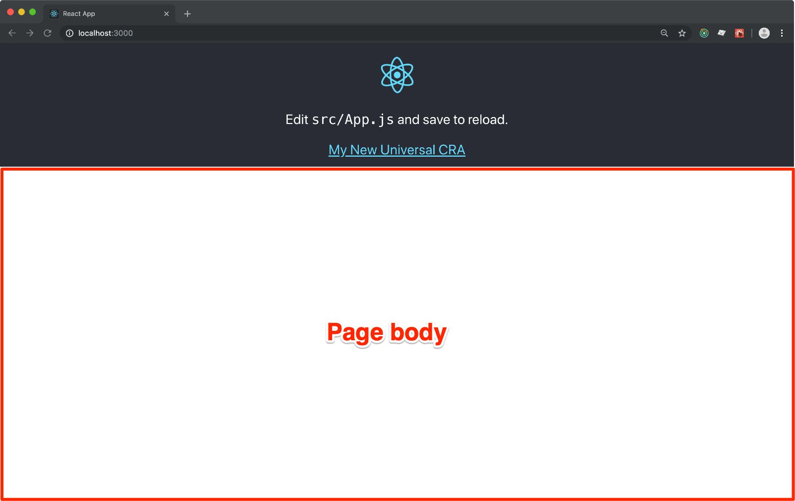
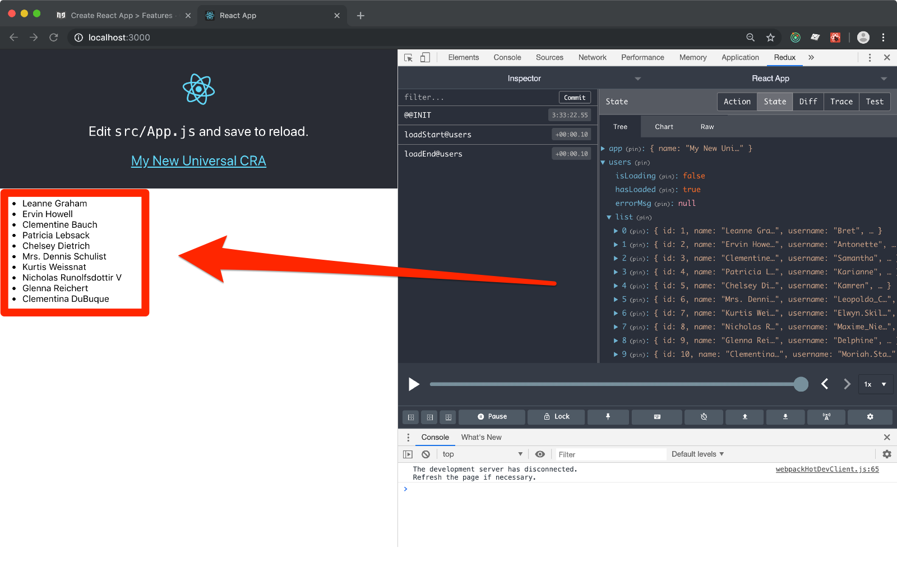

# Create React App > Features

In this step-by-step tutorial you are going to add **isolated features** to the
[_Redux_ enabled App that we set up in the previous chapter](./cra-redux.md). 
You can [download the codebase here](../downloads/cra-redux.zip).

> 🧐 A **feature** is an independent chunk of your App that **implements a specific
> business requirement**. Features can cooperate to create a comples App.

A _Redux Feature_ should normally provide:

- one or more _Redux reducers_
- one or more _Redux services_ (aka `redux-thunk`)
- one or more _React Containers_

Actually all of them are quite optional. I usually build features that are made of
_reducers_ and _services_ that are meant to provide features like
[network detection](https://www.npmjs.com/package/@forrestjs/feature-network)
or [universal storage](https://www.npmjs.com/package/@forrestjs/feature-storage).

In this tutorial you are going to build a feature that is capable of showing a list
of users asynchrnously pulled from [Tipicode](https://jsonplaceholder.typicode.com).

We are going to build this feature using the Webpack DevServer that comes bundled
with _CRA_ (`yarn start`) and then we will enjoy the very same result entirely
server-side rendered... without any change!

## Before you start...

_CRA_ comes with a full page React logo UI... Although they make a nice point with it,
I sugges you hack into the `src/App.css` and reduce the header size so to achieve
something like this:



Here are the small changes to the CSS:

```css
.App-logo {
    ...
    height: 10vmin;
}

.App-header {
    ...
    min-height: 28vh;
}
```

## A Feature's Manifest

A _Redux Feature_ is a ES6 module that exports some particular stuff like 
[_reducers_](../articles/reducers.md) or 
[_services_](../articles/services.md):

```bash
vi src/users-feature/index.js
```

and type the following dumb code:

```js
const usersReducer = () => ({ value: 'xxx' })

const usersService = {
    start: () => () => {
        console.log('*** START USERS FEATURE')
    },
}

export const reducers = { usersReducer }
export const services = [ usersService ]
```

Now open the _Redux Store_ creator:

```bash
vi src/redux-store.js
```

and add the follwing lines:

```js
...

export default createSSRState({ app }, [
    require('./users-feature'),
])
```

If you have your app running (`yarn start`) and the _DevTools_ open, you should 
see something like this:


**Point n.1:** a _Redux Feature_ can provide as many _Redux Reducers_ are needed, but they
must be unique in the App due to _Redux_ rules. Besides that, they integrate nicely with the
rest of the the previously set up state.

**Point n.2:** a _Redux Service_ is a simple collection of _thunks_. If you declare an
`init` or `start` thunks, they will be executed when your app boots. First all the `init()`
from any registered features, followed by the `starts()`. These thunks can be asyncrhonous.

**Point n.3:** if you pack a _Redux Feature_ in a directory end expose the manifest as `index.js`,
then you can simply provide an array or requires to the `createSSRState()` helper function.
It becomes a breeze to activate/deactivate entire features of your app!

## Users List Feature

The idea here is to fetch a list of users from an external API, and to show it just beneath the
homepage's header:



### The Users Reducer

```bash
vi src/users-features/users.reducer.js
```

and paste:

```js
export const initialState = {
    isLoading: false,
    hasLoaded: false,
    errorMsg: null,
    list: [],
}

/**
 * Actions
 */

export const LOAD_START = 'loadStart@users'
export const LOAD_END = 'loadEnd@users'
export const LOAD_FAILED = 'loadFailed@users'

export const loadStart = () => ({
    type: LOAD_START,
})

export const loadEnd = users => ({
    type: LOAD_END,
    payload: users,
})

export const loadFailed = errorMsg => ({
    type: LOAD_FAILED,
    payload: errorMsg,
})

/**
 * Handlers
 */

export const actionHandlers = {
    [LOAD_START]: (state) => ({
        ...state,
        isLoading: true,
    }),
    [LOAD_END]: (state, { payload }) => ({
        ...state,
        isLoading: false,
        hasLoaded: true,
        list: payload,
    }),
    [LOAD_FAILED]: (state, { payload }) => ({
        ...state,
        isLoading: false,
        hasLoaded: true,
        errorMsg: payload,
    }),
}

export default (state = initialState, action) => {
    const handler = actionHandlers[action.type]
    return handler ? handler(state, action) : state
}
```

This is a classic implementation of a reducer, you can find more details about
some coding decisions [here](../articles/reducers.md).

### The Users Service

```bash
vi src/users-features/users.service.js
```

and paste:

```js
import { loadStart, loadEnd, loadFailed } from './users.reducer'

export const loadUsers = () => async (dispatch, getState) => {
    try {
        dispatch(loadStart())
        const { ssr } = getState()
        const req = fetch('https://jsonplaceholder.typicode.com/users')
        const res = await ssr.await(req)
        const data = await res.json()
        dispatch(loadEnd(data))
    } catch (err) {
        dispatch(loadFailed(err.message))
    }
}
```

Services are just collections of [`redux-thunk`](https://www.npmjs.com/package/redux-thunk) methods.
Over the years I tried quite a few different approaches to state side effects... Thunks are
still the simplest of the solutions I found.

You can read some more details about the _Redux Service_ idea [here](../articles/services.md).

### What about `ssr.await()`?

Good catch!

This is a pseudo-reducer that is provided by _ForrestJS_ and gives you some simple superpowers
to work Server-Side Apps. 

`ssr.await()` is a _Promise proxy_ that you should use for any data-fetching (or other stuff
thay you know) that need to be awaited for during the first meaningful rendering in the Server.

But don't you worry! _ForrestJS_ ships a [network feature](https://www.npmjs.com/package/@forrestjs/feature-network)
that makes this even easier, providing you app with a dispatchable interface to basic _REST_
operations and _GraphQL_ queries.

> If you know how to `dispatch()` actions, you know how to do 
> **SSR compatible data fetching** with _ForrestJS_ 👍

### The UsersList Container

Now that we have a _reducer_ that holds our data, and a _service_ that knows how to
retrieve that data, we need to glue things together with a _Connected Component_,
commonly called _Container_:

```bash
vi src/users-features/UsersList.js
```

and paste:

```js
import React from 'react'
import { connect } from 'react-redux'
import { loadUsers } from './users.service'

const mapState = ({ users }) => users

const mapDispatch = { loadUsers }

const styles = {
    error: { color: '#f00' },
    list: { textAlign: 'left' },
}

class UsersList extends React.Component {
    constructor (props) {
        super(props)
        const { hasLoaded, loadUsers } = this.props
        if (!hasLoaded) loadUsers()
    }

    render () {
        if (this.props.isLoading) {
            return <div>loading...</div>
        }

        if (this.props.errorMsg) {
            return (
                <div style={styles.error}>
                    {this.props.errorMsg}
                </div>
            )
        }

        return (
            <ul style={styles.list}>
                {this.props.list.map(user => (
                    <li key={`user-${user.id}`}>{user.name}</li>
                ))}
            </ul>
        )
    }
}

export default connect(mapState, mapDispatch)(UsersList)
```

There is not much to say about the code above... Just that I long to be able to use
_React Hooks_ even for Server-Side Apps. 
[So far it is not supported](https://www.reddit.com/r/reactjs/comments/b762ua/data_fetching_with_ssr_with_react_hooks/) 🧐

### The Users Manifest

The feature's components are done. We can jump into the _feature's Manifest_ and
package it to be integrated with the rest of the app:

```bash
vi src/users-features/index.js
```

and paste:

```js
import users from './users.reducer'
import * as usersService from './users.service'

// exports the features capabilities:
export const reducers = { users }
export const services = [ usersService ]

// exports the UI entry point:
export { default as UsersList } from './UsersList'
```

**Note:** In a real app you may want to use 
[`react-loadable`](https://github.com/jamiebuilds/react-loadable)
to achieve **Server-Side compatible code splitting**. We'll get to that in a future
tutorial.

## Integrate the Users Feature in the App

Our _Users Feature_ now is nicely packaged and it integrates already with our
_Redux Store_ (if it doesn't, try to repeat the "_A Feature's Manifest_" paragraph).

It also exports a React component (well, a container) that we can use in the main App's
entry point to kick the data fetching and render the list:

```bash
vi src/App.js
```

and edit like:

```js
import { UsersList } from './users-feature';

function App({ name }) {
  return (
    <div className="App">
      ...
      <UsersList />
    </div>
  );
}
```

to achieve our final result:


## Server-Side Rendering

There are just two small thing that you have to fix in order to have SSR working:

1. you must provide a `fetch` polyfill as it is still not available in NodeJS
2. you need to start the Client's Redux store with the server's generated state

### Polyfill Fetch

```bash
vi server.js
```

then add:

```js
require('es6-promise').polyfill()
require('isomorphic-fetch')
```

At this point you should be good to go with the NPM script:

```
yarn serve
```

### SSR State

```bash
vi src/index.js
```

find:

```js
createState()
```

and replace it with:

```js
createState(window.SERVER_DATA)
```

Simple, is it not?

## Takeaways

1. Use _Redux Features_ to organize your codebase into **business logic components**
2. Use `ssr.await()` to wrap any Server-Side dependent `fetch` request
3. Pass the **server's Redux state** to your client's entry point

I often collect all my features into a `src/features` folder, it's just a personal
preference, but it makes good sense when you have many.

If you work on a feature that is generic (like networking stuff) you should consider
to **publish it as an NPM package for us to enjoy it**.

_ForrestJS_ maintain a few of those client side features (we are going to use them
in some future tutorials):

- [network](https://www.npmjs.com/package/@forrestjs/feature-network) helps you dealing
  with universal `fetch` and `GraphQL` queries
- [storage](https://www.npmjs.com/package/@forrestjs/feature-storage) helps you storing
  data into `localStorage` and `cookies` in a way that is SSR compatible

## Download

If you experienced any trouble following the steps above, 
[download this tutorial codebase here](../downloads/cra-features.zip).

## Challenge

Can you write a `UserDetails` container as the entry point to fetch and render a
specific user by id?

It should be used like that:

```js
import { UserDetails } from './users-feature'

...
<UserDetails userId={22} />
```

## The Next Step

In the next tutorial we are going to solve the `UserDetails` challenge and will also introduce:

- **Server-Side compatible routing** 
- **Server-Side compatible code splitting**

!!! Whooooaaaahhh!!!
