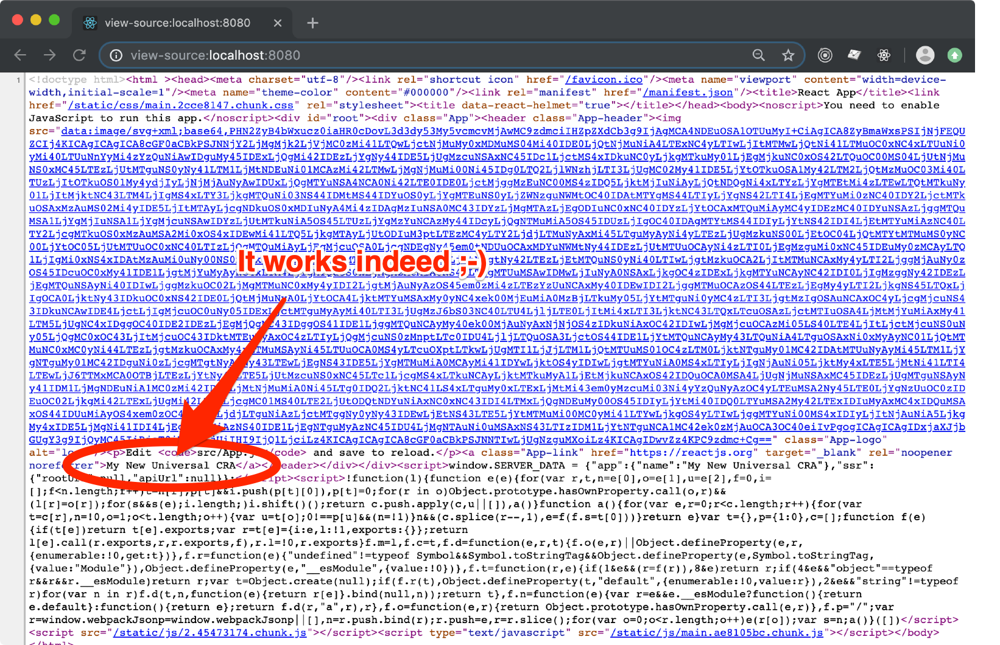

# Create React App > Redux

In this step-by-step tutorial you are going to add [Redux](https://redux.js.org/) to
[the _Universal CRA_ that you have set up in the previous chapter](./cra-ssr.md). You
can [download the codebase here](../downloads/cra-ssr.zip).

## Step n.1 - Create a Redux Store

Setting up a Redux store is often referred to as an overhelming task.

We think we managed to simplify this process a lot in _ForrestJS_ by exposing a 
utility method that injest your reducers and returns a store that is fully featured with
stuff like [redux-thunk](https://www.npmjs.com/package/redux-thunk) 
and [Redux DevTools](https://www.npmjs.com/package/redux-devtools).

In this first tutorial you are going to use the `createSSRState()` in the easiest
of the possible way:  
**JUST ADD REDUCERS TO IT**. 

> This suits 90% of the apps that I write.

But keep in mind that **this is a highly extensible tool** and you can configure it 
with new middlewares, decorators and basically any kind of extension that you may need.

Create `src/redux-store.js`:

```bash
vi src/redux-store.js
```

and paste this code into it:

```js
import createSSRState from '@forrestjs/core/lib/create-ssr-state'

const app = () => ({
    name: 'My New Universal CRA',
})

export default createSSRState({ app })
```

It is worth noticing that `createSSRState()` **is a function that returns a NEW store**
configured to suit your needs. Every time you call it it will generate a brand new store.

This behaviour is **crucial to Server-Side Rendering** as you really need to 
**protect the _execution context_** of you app in Node.

_ForrestJS_ takes care of this for you. Just remember that any piece of information that 
you put in **the Redux store is scoped to each server request** by design, making it
the safest place where to actually store data.

## Step n.2 - Provide your Client entry point

Now is time to provide our App's entry point with the Redux store, so that
you can use the `connect()` method to withdraw informations from it.

Open `src/index.js`:

```bash
vi src/index.js
```

then find the line:

```js
ReactDOM.render(<App />, document.getElementById('root'));
```

and replace with:

```jsx
import { Provider } from 'react-redux';
import createState from './redux-store';

const Root = ({ store, ...props }) => (
    <Provider store={store}>
        <App {...props} />
    </Provider>
);

createState()
    .then(props => ReactDOM.render(<Root {...props} />, document.getElementById('root')))
    .catch(err => console.error(err));
```

It is worth noticing that **the `createState()` function is _asynchronous_**. I don't
really want to go deep into details in this tutorial, but just keep in mind that your
Application's state is capable of doing **asynchronous booting operations** :-)

## Step n.3 - Provide your Universal entry point

We need to modify the Server-Side entry point in a very similar way. No big deal.

Open `src/index.ssr.js`:

```bash
vi src/index.ssr.js
```

find the line:

```js
export const staticRender = createSSRRender(App)
```

and replace with:

```jsx
import React from 'react'
import { Provider } from 'react-redux'
import createState from './redux-store'

const Root = ({ store, ...props }) => (
    <Provider store={store}>
        <App {...props} />
    </Provider>
);

export const staticRender = createSSRRender(Root, { createState })
```

> **Why do you duplicate the `Root` component's code?**  
> I'm glad you asked!

In one of the tutorials ahead you are going to add
[react-router](https://reacttraining.com/react-route) to your app.

At that point the `Root` component that runs in the server-side rendering will need 
a special version of the _router provider_ called `StaticRouter`, while the
client-side version need the normal `Router` and a `history` component that
is capable of using the
[browser's history API](https://developer.mozilla.org/en-US/docs/Web/API/History).

In this tutorial we are laying down the fundations for that implementation.

## Step n.4 - Use the App's reducer info

It's now time to use the Redux store we built and render the App's name
into the UI.

You are going to make a few changes to `src/App.js`, but if
you are already familiar with Redux, you have probably already done it :-)

```bash
vi src/App..js
```

find:

```js
function App() {
```

and replace with:

```js
import { connect } from 'react-redux';

const mapState = ({ app }) => ({
  name: app.name,
});

function App({ name }) {
```

then find:

```js
Learn React
```

and replace it with:

```js
{name}
```

**finally** find:

```js
export default App;
```

and replace it with:

```js
export default connect(mapState)(App);
```

## Test it out!

Now it's time to run:

```bash
yarn start
```

And enjoy your Redux's state manager working, and the Redux DevTools magically
set up for you.


And you should also test it Server Side Rendered:

```bash
yarn serve
```



## Download

If you experienced any trouble following the steps above, 
[download this tutorial codebase here](../downloads/cra-redux.zip).

## The Next Step

_ForrestJS_'s Redux setup ships with an intersting feature which is called...
[react-redux-feature](https://www.npmjs.com/package/react-redux-feature).

It basically provides a simple indication how to organize your application into
smaller pieces - the _features_ - and how to let them talk together in a nice
and predictable way.

👉 [CLICK HERE if you can't resist and are so curious about it :-)](./cra-features.md)

