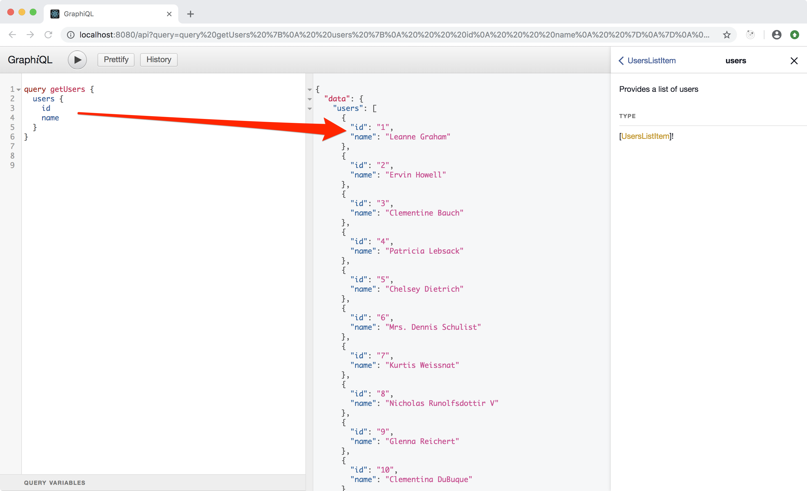

# GraphQL - Backend

Now that we have a functional GraphQL setup it is time to create some useful
endpoints that our frontend can use instead of dealing with `jsonplaceholder`:

- get users list
- get a single user data
- get todos list, optionally filtered by user id
- get albums list, optionally filtered by user id

The cool cool thing about GraphQL is that we can implement those endpoints in
isolation, but then our frontend will be able to **query more than one endpoint in
the same HTTP request**!

## Jsonplaceholder Library

Create `/ssr/jsonplaceholder.js`:

    // https://jsonplaceholder.typicode.com
    // data interface

    const baseUrl = 'https://jsonplaceholder.typicode.com'

    export const fetchUsersList = async () => {
        const res = await fetch(`${baseUrl}/users`)
        return await res.json()
    }

    export const fetchUserData = async (userId) => {
        const res = await fetch(`${baseUrl}/users/${userId}`)
        return res.json()
    }

    export const fetchUserTodos = async (userId = null) => {
        const url = `${baseUrl}/todos`
        const filter = userId !== null ? `userId=${userId}` : ''
        const res = await fetch(`${url}?${filter}`)
        return res.json()
    }

    export const fetchUserAlbums = async (userId = null) => {
        const url = `${baseUrl}/albums`
        const filter = userId !== null ? `userId=${userId}` : ''
        const res = await fetch(`${url}?${filter}`)
        return res.json()
    }

I really like to work out small library modules that **implement a 
specific responsability**. In this case we scope into this module the knowledge
of "how to deal with jsonplaceholder".

Our GraphQL endpoints will use this library. Their responsibility will be to
structure the shape of the data.

**NOTE:** I'm not doing error handling here. This is a tutorial and I believe you
are a pro and will implement the due error handling in your apps!

> I'm a true fan of the
> [single responsibility principle](https://en.wikipedia.org/wiki/Single_responsibility_principle)
> and you should consider embracing it as well.

## List all users

Create `/ssr/graphql/users.query.js`:

    import {
        GraphQLNonNull,
        GraphQLList,
        GraphQLObjectType,
        GraphQLID,
        GraphQLString,
    } from 'graphql'

    import { fetchUsersList } from '../jsonplaceholder'

    export default {
        description: 'Provides a list of users',
        type: new GraphQLNonNull(new GraphQLList(new GraphQLObjectType({
            name: 'UsersListItem',
            fields: {
                id: { type: new GraphQLNonNull(GraphQLID) },
                name: { type: new GraphQLNonNull(GraphQLString) },
            },
        }))),
        resolve: fetchUsersList,
    }

and add the query to the manifest in `/ssr/graphql/index.js`:

    const queries = {
        ...
        users: require('./users.query').default,
    }

Now you can use your Graphiql UI to run the query:

    query getUsers {
        users {
            id
            name
        }
    }

## Get a single user

Create `/ssr/graphql/user.query.js`

    import {
        GraphQLNonNull,
        GraphQLObjectType,
        GraphQLID,
        GraphQLString,
    } from 'graphql'

    import { fetchUserData } from '../jsonplaceholder'

    export default {
        description: 'Provide a single user by ID',
        args: {
            id: {
                type: new GraphQLNonNull(GraphQLID),
            },
        },
        type: new GraphQLObjectType({
            name: 'User',
            fields: {
                id: { type: new GraphQLNonNull(GraphQLID) },
                name: { type: new GraphQLNonNull(GraphQLString) },
                email: { type: new GraphQLNonNull(GraphQLString) },
                phone: { type: new GraphQLNonNull(GraphQLString) },
                website: { type: new GraphQLNonNull(GraphQLString) },
                company: {
                    type: new GraphQLObjectType({
                        name: 'UserCompany',
                        fields: {
                            name: { type: new GraphQLNonNull(GraphQLString) },
                            catchPhrase: { type: new GraphQLNonNull(GraphQLString) },
                        },
                    }),
                },
                address: {
                    type: new GraphQLObjectType({
                        name: 'UserAddress',
                        fields: {
                            street: { type: new GraphQLNonNull(GraphQLString) },
                            suite: { type: new GraphQLNonNull(GraphQLString) },
                            city: { type: new GraphQLNonNull(GraphQLString) },
                            zipcode: { type: new GraphQLNonNull(GraphQLString) },
                        },
                    }),
                },
            },
        }),
        resolve: (params, args) => fetchUserData(args.id),
    }

and add the query to the manifest in `/ssr/graphql/index.js`:

    const queries = {
        ...
        user: require('./user.query').default,
    }

I'm sure you noticed the `args` property now. This is how we define input data to a
query. In this case we want to grab a user by it's own id.

Here is the query:

    query getUser($id: ID!) {
        user (id: $id) {
            id
            name
            phone
            email
            company {
                name
                catchPhrase
            }
            address {
                city
                street
                suite
                zipcode
            }
        }
    }

and the variables that you need to provide:

    {
        "id": 1
    }

## Other queries

Create `/ssr/graphql/todos.query.js`

    import {
        GraphQLNonNull,
        GraphQLList,
        GraphQLObjectType,
        GraphQLID,
        GraphQLString,
        GraphQLBoolean,
    } from 'graphql'

    import { fetchUserTodos } from '../jsonplaceholder'

    export default {
        description: 'Provide a list of todos, can be filtered by user',
        args: {
            userId: {
                type: GraphQLID,
            },
        },
        type: new GraphQLNonNull(new GraphQLList(new GraphQLObjectType({
            name: 'TodoItem',
            fields: {
                id: { type: new GraphQLNonNull(GraphQLID) },
                userId: { type: new GraphQLNonNull(GraphQLID) },
                title: { type: new GraphQLNonNull(GraphQLString) },
                completed: { type: new GraphQLNonNull(GraphQLBoolean) },
            },
        }))),
        resolve: (params, args) => fetchUserTodos(args.userId),
    }

and `/ssr/graphql/albums.query.js`

    import {
        GraphQLNonNull,
        GraphQLList,
        GraphQLObjectType,
        GraphQLID,
        GraphQLString,
    } from 'graphql'

    import { fetchUserAlbums } from '../jsonplaceholder'

    export default {
        description: 'Provide a list of albums, can be filtered by user',
        args: {
            userId: {
                type: GraphQLID,
            },
        },
        type: new GraphQLNonNull(new GraphQLList(new GraphQLObjectType({
            name: 'AlbumItem',
            fields: {
                id: { type: new GraphQLNonNull(GraphQLID) },
                userId: { type: new GraphQLNonNull(GraphQLID) },
                title: { type: new GraphQLNonNull(GraphQLString) },
            },
        }))),
        resolve: (params, args) => fetchUserAlbums(args.userId),
    }

and add them to the manifest in `/ssr/graphql/index.js`:

    const queries = {
        ...
        todos: require('./todos.query').default,
        albums: require('./albums.query').default,
    }

## The Full User Request

I previously wrote that GraphQL allow you to run multiple queries in a single request.
Here is the noticeable example that will radically improve our app:

    query getUser($userId: ID!) {
        user (id: $userId) {
            id
            name
            phone
            email
            company { name }
            address { city }
        }
        todos (userId: $userId) {
            id
            title
            completed
        }
        albums (userId: $userId) {
            id
            title
        }
    }

and the variables:

    {
    "userId": 1
    }

