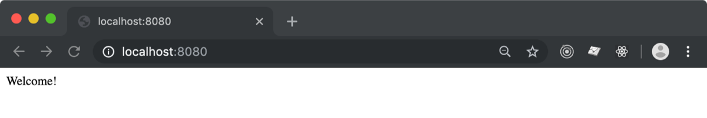

# GraphQL made easy with Hooks

Facebook's crew didn't only came up with [React](https://reactjs.org/) and 
[PropTypes](https://reactjs.org/docs/typechecking-with-proptypes.html)... they also produced
[GraphQL](https://graphql.org/)!

> GraphQL is to _REST Api_ what PropTypes is to _React Components' Props_

This is the simplest explanation to GraphQL that I came up with.<br>
You basically **describe the arguments to a particular request**, and you 
**describe the output data structure**.

GraphQL provides 2 major benefits (plus many other):

- input / output schema validation
- fetch from multiple end points within a single request

Honestly, I hardly imagine working out an API without it. It's like the good ol'
[Json Schema](https://json-schema.org/) but on steroid.

---

Enough with the intro, in this tutorial you **learn how to setup a GraphQL API service**
in NodeJS, using [ExpressJS](https://expressjs.com/) an [ForrestJS' Hooks](./hooks.md).

> If you just want to see this in action, [download this tutorial codebase here](../downloads/hooks-graphql.zip),<br>
> then run `yarn boot`.

## Step n.1 - Create a Hooks App

Initialize a new _NodeJS_ project (`yarn init`) then install the hooks:

```bash
yarn add @forrestjs/hooks
```

Then copy this [_Hooks_](./hooks.md) skeleton app into `index.js`:

```js
const { runHookApp } = require('@forrestjs/hooks')
runHookApp([ /* features go here */ ])
```

At last you can run this app with `npx`:

```bash
NODE_ENV=development npx nodemon index.js
```

You might notice that... nothing happens!<br>
That's right, this is just an empty Hooks based app.

**NOTE:** It is quite important to set `NODE_ENV=development` to have some cool stuff
available later in the tutorial. Stick with it for now.

## Step n.2 - Add ExpressJS Service

Running an ExpressJS on ForrestJS is a really easy task.

> If you want a better explanation of what we are about to do,<br>
> you may want to [checkout the _Hooks_ tutorial](./hooks.md) first.

First install the service package:

```bash
yarn add @forrestjs/service-express
```

Then modify `index.js` to register the new service:

```js
runHookApp([
    require('@forrestjs/service-express'),
])
```

Run the app again and we notice that some kind onf service is up and running on `8080`:


But if you try to navigate to `http://localhost:8080` you'll face bad luck:


That is because `@forrestjs/service-express` creates an ExpressJS app for you all right, 
but it doesn't provide any route route to it.

### 2b - Add your first route

It is up to you to create a custom feature and implement some your business logic,
here follows a super short tutorial **how to create your first route**.

First let's create a new _NodeJS_ module where to place this piece of logic:

```bash
vi home.route.js
```

And paste this code into it:

```js
const { EXPRESS_ROUTE } = require('@forrestjs/service-express')

const routeHome = ({ app }) =>
    app.get('/', (_, res) => res.send('Welcome!'))

module.exports = [ EXPRESS_ROUTE, routeHome ]
```

Believe it or not, this is a perfectly functionable _ForrestJS_'s feature!

The next step is just to register it into your _Hooks App_:

```js
runHookApp([
    require('@forrestjs/service-express'),
    require('./home.route'),
])
```

Reload your `http://localhost:8080` and the magic is just blowing out your mind!



Of course now you can add all the routes you may need, but let's stick to the plan and
move into _GraphQL_ service.

## Step n.3 - Add GraphQL

I guess you got the drill by now... Let' first install the _ForrestJS_'s package:

```bash
yarn add @forrestjs/service-express-graphql
```

Then register it into pur App:

```js
...

runHookApp([
    ...
    require('@forrestjs/service-express-graphql'),
])

```

This is still a very small codebase, but if you try to hit:

```
http://localhost:8080/api
```

Things start to look quite juicy now:


`@forrestjs/service-express-graphq` does a couple of things just out of the box:

1. it mounts [`express-graphql`](https://github.com/graphql/express-graphql) on the `/api` route in your _ExpressJS_ service
2. activates _GraphiQL_ UI in develpment (that's why `NODE_ENV=development`)
3. it provides an `info` query and mutation (but you can override it of course)

> As with everything in _ForrestJS_, most of the default behaviours are fully configurable
> via the App's configuration or _Environment Variables_.

## Step n.4 - Add your own Queries and Mutations

There are plenty of _GraphQL_ tutorials out there, so here we will focus in writing
a simple query that shows how to use the `EXPRESS_GRAPHQL` hook.

First create a new _Hooks Feature_ where to implement the query,
just because it is nice to keep an eye on the
[_Single Responsibility Principle_](https://en.wikipedia.org/wiki/Single_responsibility_principle) 😏

```bash
vi welcome.query.js
```

And paste this code in it:

```js
const { EXPRESS_GRAPHQL } = require('@forrestjs/service-express-graphql')
const { GraphQLList, GraphQLString } = require('graphql')

const welcomeHandler = (_, args, { req }) => [
    `Welcome, ${args.name}!`,
    req.protocol + '://' + req.get('host') + req.originalUrl,
]

const welcomeQuery = ({ queries }) => 
    queries.welcome = {
        description: 'Welcome the user',
        args: {
            name: {
                type: GraphQLString,
                defaultValue: 'user',
            },
        },
        type: new GraphQLList(GraphQLString),
        resolve: welcomeHandler,
    }

module.exports = [ EXPRESS_GRAPHQL, welcomeQuery ]
```

Now it's just a matter of registering the new feature in your app:

```js
...

runHookApp([
    ...
    require('./welcome.query'),
])
```

Reload your _GraphiQL_ and enjoy your new `welcome` endpoint:


**NOTE n.1:** The [`service-express-graphql`](https://github.com/forrestjs/forrestjs/tree/master/packages/service-express-graphql)
decorates the query's _context_ with the `req` and `res` objects from the
_ExpressJS_' middleware. This comes in handy if you plan to have some middlewars that
**add informations into the request's context** and you plan to access them at resolve time.

**NOTE n.2:** Most of the time I even split the query's definition from the query's
implementation (the `resolve` function) into two separated modules. I do that mostly
because of testability, but it time it turns our a very good practice.

## Configuration - How to change the Endpoint name

Say you don't like `/api` as endpoint for your GraphQL... say you'd prefer `/graphql`.

Here is how you can hook into the App's boot process and provide custom configuration:

```js
const { runHookApp } = require('@forrestjs/hooks')
const { registerAction, SETTINGS } = require('@forrestjs/hooks')

registerAction([SETTINGS, ({ settings }) => {
    settings.express = {
        graphql: {
            mountPoint: '/graphql',
        },
    }
}])

runHookApp([
    require('@forrestjs/service-express'),
    require('./home.route'),
    require('@forrestjs/service-express-graphql'),
    require('./welcome.query'),
])
```

## Download

If you experienced any trouble following the steps above, 
[download this tutorial codebase here](../downloads/hooks-graphql.zip).

## Challenge

You now have all the basics components to play around with your ExpressJS app and GraphQL.

Can you build a **simple authentication system** so that a mutation will give you access
to some protected queries?
