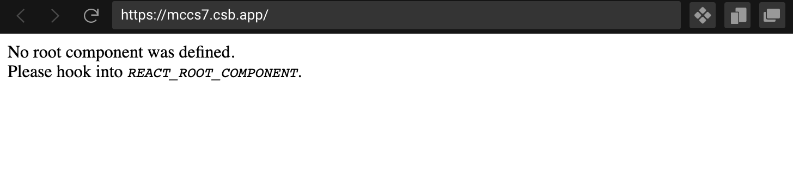
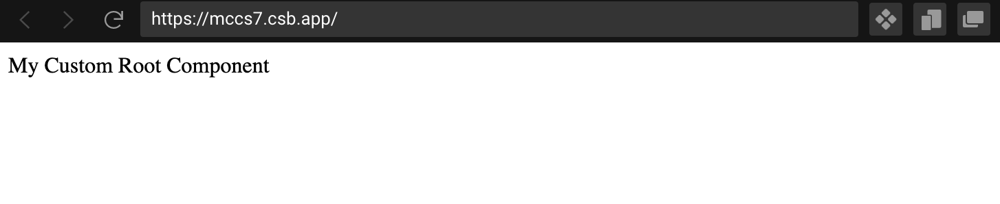

<h1 class="tutorial-step"><span>My First React App &raquo;</span> Render a ForrestJS React App</h1>

[My First React App](../README.md) &raquo; [Render a ForrestJS React App](./README.md)

---

# Render a ForrestJS React App

A classic [_CRA_](https://reactjs.org/docs/create-a-new-react-app.html#create-react-app) App uses `import` to build a _static tree of dependencies_ that needs to be rendered.

This happens in the `/index.js` where we use the `ReactDOM.render()` API to initiate the rendering of our _root Component_ (usually `/App.js`).

In a ForrestJS App things are a bit different, as we use the `/index.js` as the **App's Manifest** where we simply list the Services and Features that will compose our App's capabilities:

```js
// Import Libraries:
import { runHookApp } from '@forrestjs/hooks';

// Import Services:
import reactRoot from '@forrestjs/react-root';

// Run the ForrestJS App:
runHookApp({
  trace: 'compact',
  services: [reactRoot],
}).catch((err) => console.error(`Boot: ${err.message}`));
```

> The [react-root](https://github.com/forrestjs/react/tree/main/packages/react-root#readme) Service **renders the root Component** of your App, and provides hooks to customize such component, as well as to apply any number of wrappers.

This source code will render a React App with a default component. The result will be something like:



👉 From now on, it is just a matter of adding Features to our ForrestJS App, much like we do in the backend!

## Implement the REACT_ROOT_COMPONENT Hook

In order to customize the _root Component_ of the App, we can write the simplest possible Feature ever:

```js
const customRoot = {
  hook: '$REACT_ROOT_COMPONENT',
  handler: () => <div>My Custom Root Component</div>,
};
```

and then list it into the App's manifest:

```js
runHookApp({
  services: [reactRoot],
  features: [customRoot],
}).catch((err) => console.error(`Boot: ${err.message}`));
```

Here is a preview of the resulting App:



## Cleanup From CRA Boilerplate

As we will build a fully custom App using [MUI](https://mui.com/) as Component Library, you can now remove all the other _CRA_ boilerplate files from your `/src` folder.

<iframe src="https://codesandbox.io/embed/010-react-root-mccs7?fontsize=14&hidenavigation=1&theme=dark"
     style="width:100%; height:500px; border:0; border-radius: 4px; overflow:hidden;"
     title="010-react-root"
     allow="accelerometer; ambient-light-sensor; camera; encrypted-media; geolocation; gyroscope; hid; microphone; midi; payment; usb; vr; xr-spatial-tracking"
     sandbox="allow-forms allow-modals allow-popups allow-presentation allow-same-origin allow-scripts"
   ></iframe>
