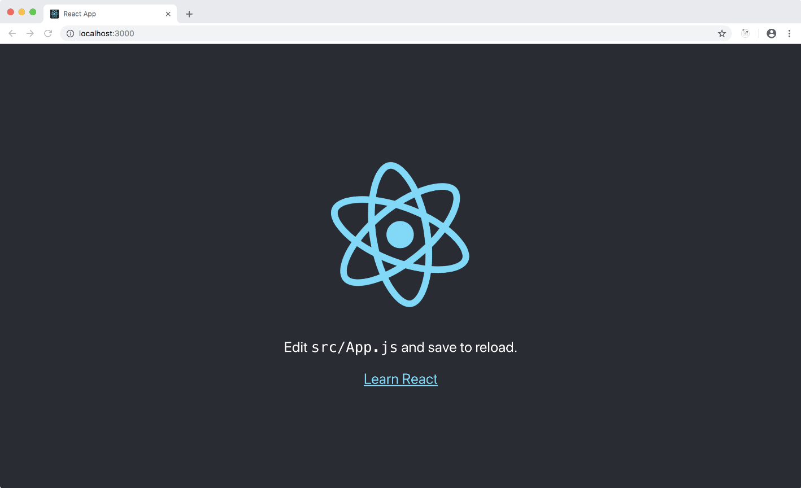

# Prerequisites & Setup

### Step n.1

The entire set of examples assume that you are going to use
[create-react-app](https://facebook.github.io/create-react-app/)
as boilerplate for you application, so the first step would be to initialize a new
CRA project (*):

    npx create-react-app cra-ssr --scripts-version react-scripts-rewired

> **NOTE:** We are going to do some **cool stuff with code splitting** and
> [react-loadable](https://www.npmjs.com/package/react-loadable).  
> Unfortunately `create-react-app` doesn't support code splitting very well and we really
> need to hack into the `Webpack.config` in order to enable stuff. If you omit
> `--scripts-version react-scripts-rewired` everything will work just fine, but you will
> notice some flickering when running the final server side rendered app.

### Step n.2

Now you can `cd` into your project and install the `@marcopeg/react-ssr` library:

    cd cra-ssr
    npm install @marcopeg/react-ssr --save

### Step n.3

The last step is to install the peer dependencies:

    npm install --save \
      redux \
      react-redux \
      react-loadable

Those packages are extremely likely to to be used in your own code base so we decided
not to include them as direct dependencies. You will have full control over their
version and upgrading via your project's `package.json`.

## NPM Scripts

So far we just installed dependencies so the basic scripts that were created by
`create-react-app` are in place with their default behaviour.

**This will not change during the course of this tutorial :-)**

I really like the idea of having a common ground in `create-react-app` (even if I
don't share all the decisions they made!) and I did my best to provide a simple
way to enrich that basic ground without breaking it.

With all that said, you can spin up your app:

      npm start

      

## (*) react-scripts-rewired

Most of the examples work with the default setup, but when it comes to
the **server side rendering of an application that implements code splitting** with
[react-loadable](https://github.com/jamiebuilds/react-loadable) you are goint to
need to make a small fix to the default [Webpack](https://webpack.js.org/) configuration.

I usually use [react-scripts-rewired](https://www.npmjs.com/package/react-scripts-rewired)
which implements a light extension of the default `react-scripts` package and allows
our project to extend the default configuration:

    npx create-react-app cra-ssr --scripts-version react-scripts-rewired
