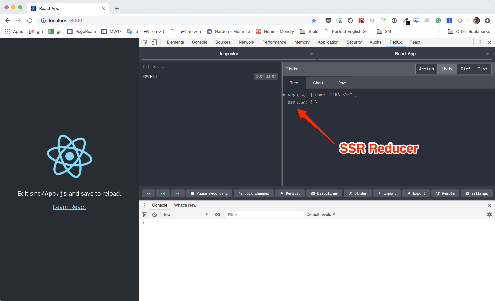
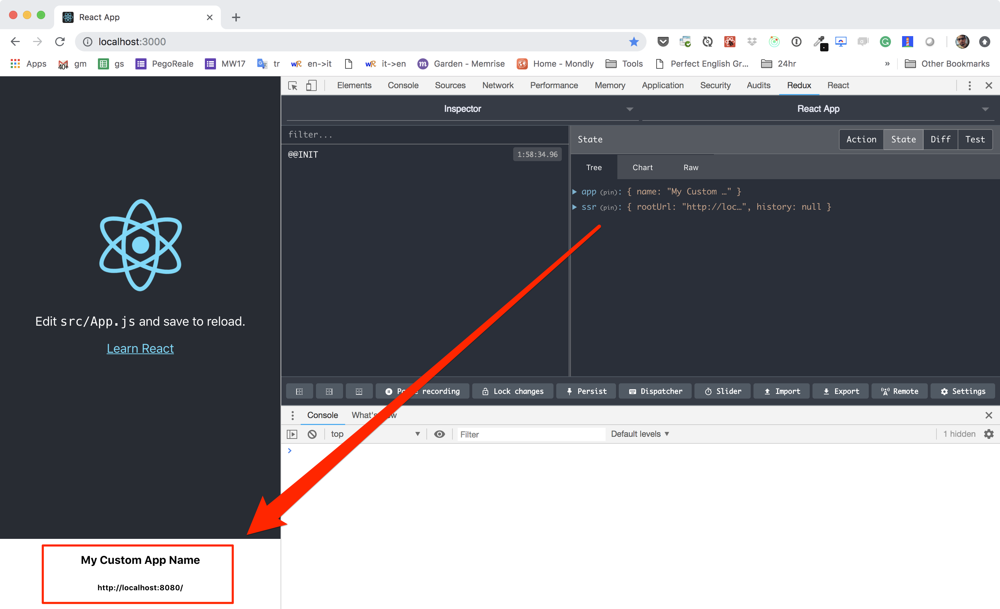

## Add Reducers & Initial State

**Spoiler alert:** later on I will suggest you structure your app in
[features](https://www.npmjs.com/package/react-redux-feature) so to keep business
logic, as well as reducers, thunks and business specific components, well encapsulated.
But for now let's see how to add some generic reducers and set up an initial state.

## App Generic Reducers

**NOTE:** I assume you already know a lot about redux reducers, but if you want to have
a quick _go-through_ just [click here](../articles/reducers.md).

We are going to work in `src/state.js` and the idea is to add a super simple reducer
who's responsability is to hold the name of the app itself:

    ...
    
    // define the reducers that we want to add:
    const reducers = {
        app: (state = { name: 'CRA SSR' }) => state,
    }

    // add the reducers into the store creator function:
    export const createState = createSSRState(reducers)

**What is the "ssr" reducer that I see in the dev tools?**

Glad you asked, and if you didn't notice it I suggest you take a close look at your
app's state in redux devtools:

This reducer is added by `@marcopeg/react-ssr` and its purpose is to provide helping
functionalities and informations in order to facilitate server side rendering.

We will discuss it later on, but just as an example you will be able to generate
urls that point back to the server, and run `fetch()` requests that work in the
backend too:

    const { ssr } = getState()
    const endpoint = ssr.getRootUrl('/foo')
    const res = await ssr.await(fetch(endpoint))

## Initial State

The Intial State of your application is set up in `src/index.js` and fed into
the `createState()` function:

    ...

    const initialState = window.__REDUX_INITIAL_STATE__ || {
        app: { name: 'My Custom App Name' },
        ssr: {
            rootUrl: 'http://localhost:8080/',
            apiUrl: 'http://localhost:8080/api/',
        },
    }

    ...

    createState(initialState)
        .then(boot)

Notice that we set up an initial state for the `ssr` reducer. That piece of our
app needs to know how to reach out for the backend.

Right now we have no backend, but we are going to have one so it's not a bad idea
to leave this settings as they are.

The app also tries to read the state from the `window.__REDUX_INITIAL_STATE__` global
variable, this leave you the possibility to set this stuff in the HTML entry point.
Guess what? That exactly what is going to happen during ssr.

## Test it up!

Let's create a small container that is capable of rendering some stuff from the state.  

Create `src/AppName.js`:

    import React from 'react'
    import { connect } from 'react-redux'

    const mapState = ({ app, ssr }) => ({
        appName: app.name,
        backendRoot: ssr.getRootUrl('/'),
    })

    const AppName = ({ appName, backendRoot }) => (
        

            <h4>{appName}</h4>
            <h6>{backendRoot}</h6>
        

    )

    export default connect(mapState)(AppName)

Now we can simply append it into the `src/App.js` right after the `header`:

    ...
    import AppName from './AppName'
    ...

    class App extends Component {
        render() {
            return (
                ...
                </header>
                <AppName />
                ...
            )
        }
    }

