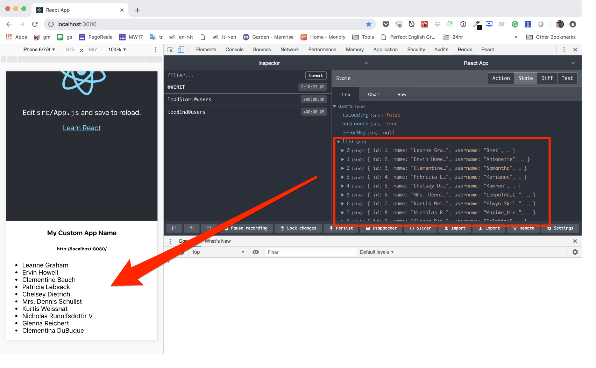

## Users Feature

In this feature we are going to fetch and display a list of users from
a [jsonplaceholder](https://jsonplaceholder.typicode.com/users) API.

By the end of this tutorial we should reach together a similar outcome:

### Step 1 - the reducer

Let's start with the boring part. The reducer.

We need to keep track of the loaded users, as well of some meta data like:

- is the loading happending?
- did we perform our first load? Or are we reloading?

Here is the reducer code that I've come up with.
Put this into `/src/features/users/users.reducer.js`:

    export const initialState = {
        isLoading: false,
        hasLoaded: false,
        errorMsg: null,
        list: [],
    }

    /**
    * Actions
    */

    export const LOAD_START = 'loadStart@users'
    export const LOAD_END = 'loadEnd@users'
    export const LOAD_FAILED = 'loadFailed@users'

    export const loadStart = () => ({
        type: LOAD_START,
    })

    export const loadEnd = users => ({
        type: LOAD_END,
        payload: users,
    })

    export const loadFailed = errorMsg => ({
        type: LOAD_FAILED,
        payload: errorMsg,
    })

    /**
    * Handlers
    */

    export const actionHandlers = {
        [LOAD_START]: (state) => ({
            ...state,
            isLoading: true,
        }),
        [LOAD_END]: (state, { payload }) => ({
            ...state,
            isLoading: false,
            hasLoaded: true,
            list: payload,
        }),
        [LOAD_FAILED]: (state, { payload }) => ({
            ...state,
            isLoading: false,
            hasLoaded: true,
            errorMsg: payload,
        }),
    }

    export default (state = initialState, action) => {
        const handler = actionHandlers[action.type]
        return handler ? handler(state, action) : state
    }

**NOTE:** If you want to deepen the understanding of this code, have a read
at the [reducer article](../articles/reducers.md)

Now we can add the reducer to the feature's manifest in
`src/features/users/index.js`:

    import users from './users.reducer'

    // exports the features capabilities:
    export const reducers = { users }
    export const services = []
    export const listeners = []

And finally we activate our feature by listing it in the features manifest
`src/features/index.js`:

    export default [
        require('./users'),
    ]

If everything went well, you should be able to see the new reducer correcly
listed in the app' state (using Redux devTools):

### Step 2 - the service

I use to call Redux asynchronous actions "services". It is shorter and _IMHO_
does a better job of representing the purpose of that code. [You can find some
more details here](../articles/services.md).

Anyway in this file we write the logic that is in charge of fetching data from
the web and populate our reducer. All the stuff goes into
`src/features/users/users.service.js`:

    import { loadStart, loadEnd, loadFailed } from './users.reducer'

    export const loadUsers = () => async (dispatch, getState) => {
        try {
            dispatch(loadStart())
            const { ssr } = getState()
            const req = fetch('https://jsonplaceholder.typicode.com/users')
            const res = await ssr.await(req)
            const data = await res.json()
            dispatch(loadEnd(data))
        } catch (err) {
            dispatch(loadFailed(err.message))
        }
    }

Note how we use the `ssr` helper to wrap our _HTTP Request_. We don't really need
it right now because we are not yet running this thing on the server. But keep in
mind that this is the only thign you need to put in place in order to have a
**correct and fluent server side rendering!**

Simple, right?

### Step 3 - the container

It's now the right moment to finally step into some React coding and use the data
we store in the Redux' state to provide some decent UI. Paste the following code
into `src/features/users/Users.container.js`:

    import React from 'react'
    import { connect } from 'react-redux'
    import { loadUsers } from './users.service'

    const mapState = ({ users }) => users

    const mapDispatch = { loadUsers }

    const styles = {
        error: { color: '#f00' },
        list: { textAlign: 'left' },
    }

    class Users extends React.Component {
        constructor (props) {
            super(props)
            const { list, loadUsers } = this.props
            if (!list.length) loadUsers()
        }

        render () {
            if (this.props.isLoading) {
                return 
loading...

            }

            if (this.props.errorMsg) {
                return (
                    

                        {this.props.errorMsg}
                    

                )
            }

            return (
                <ul style={styles.list}>
                    {this.props.list.map(user => (
                        <li key={`user-${user.id}`}>{user.name}</li>
                    ))}
                </ul>
            )
        }
    }

    export default connect(mapState, mapDispatch)(Users)

I did my best to keep this as simple as possible. You can do a way better job
in structuring this thing into some dumb components and, of course, by
applying prop-types, or Flow or TypeScript...

But I would like you to notice that I've used `constructor()` instead of
the most obvious `componentDidMount` for my network request.. I did that on
 purpose so to make this container server side compatible.

React does not trigget `componentDidMount` durig ssr and at the moment of the
writing (Nov18) there still some uncertainty about how new versions of React will
handle asynchronous rendering.

### Step 4 - use the feature

The last step would be to place the `<Users />` container somewhere within our
`<App />` so that it can be rendered, the network request triggered using our
service, the reducer updated and the users list produced.

Before we do that let's have the users feature's manifest file to export the
ui entry point. Edit `src/features/users/index.js` as follow:

    import loadable from 'react-loadable'
    import users from './users.reducer'

    // exports the features capabilities:
    export const reducers = { users }
    export const services = []
    export const listeners = []

    // exports the UI entry point asynchronously:
    export const Users = loadable({
        loader: () => import('./Users.container'),
        loading: () => 'loading...'
    })

With this step done, we can now use the feature in `src/App.js`:

    ...
    
    import { Users } from './features/users'

    ...

    class App extends Component {
        render() {
            return (
                    ...
                    <Users />
                

            )
        }
    }

The end result should look like this:

## A word on async features

I'm sure you noticed that we export out `Users` containers with
[react-loadable](https://github.com/jamiebuilds/react-loadable).

We could have done a much easier export like:

    export { default as Users } from './Users.container'

So why `react-loadable`?

Well, that is to optimize the bundle size of our app of course! Instead of
producing a single big production bundle file, Webpack is going to generate
a smaller bundle for the main app, and another for the users feature.

Weeeelll... more or less! The truth is that the reducer is going to be part
of the main bundle as well. I played a lot with dynamically loaded reducers
and I must say I find that practice a bit confusing.

It will make you spare some bites in the main bundles, at the cost of increasing
the state manager complexity.

Reducers should hold a very simple responsibility: migrating the state to a new
version. This code is quite simple and does not require error handling because
it is not supposed to fail (if it does it's a bug, not an error to handle!).

_IMHO_ Services hold the complex part of your business logic. Services deal with
network, user input, storage strategies... Services deal with stuff that can
(and will) fail. They do need to perform error handling... extensively!

And then containers/components may bring alogn a big portion of code. React and
CSS, icons and background images... It could sum up to a big chunk of code.

With all that in mind, I believe is a nice compromise to load you reducers
synchronously and your UI/Services asynchronously.
